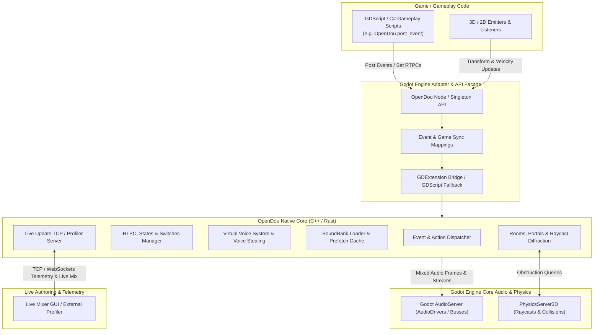

# OpenDou Audio Engine Architecture Overview

## 1. Executive Summary

**OpenDou** is an open-source, high-performance audio engine and middleware specifically engineered for **Godot 4.7+**. It brings the architectural strengths of industry-standard tools (Wwise and FMOD Studio) into the Godot ecosystem with zero licensing friction.

The architecture decouples game logic from audio playback by introducing an **Event & Action Dispatcher**, a **Virtual Voice System**, an **RTPC Parameter Engine**, a **Prefetched SoundBank Pipeline**, **Rooms & Portals Spatial Acoustics**, and a **Live Update TCP Server**.

---

## 2. Global Architecture Diagram

---

## 3. Subsystem Breakdown

### 3.1. Event & Action Dispatcher (`core/events/`)
* Translates high-level string/hashed identifiers (`post_event("Play_Explosion", self)`) into a sequence of atomic audio actions (*Play*, *Stop*, *Set Switch*, *Set State*, *Post Trigger*, *Bypass Effect*).
* Executes without attaching or managing Godot scene nodes.

### 3.2. Game Syncs & RTPC Modulation (`core/syncs/`)
* **RTPC (Real-Time Parameter Controls):** Continuous floating-point inputs mapped via custom cubic or bezier curves to volume, pitch, low-pass filter cutoff, or send levels.
* **States & Switches:** Global game contexts (`GameState = Combat`) and per-entity contextual variables (`SurfaceType = Metal`).

### 3.3. Virtual Voice System & Dynamic Stealing (`core/voices/`)
* **Virtual Voice Tracking:** When a sound drops below the audibility threshold or is occluded/out of range, it switches to a virtual state where elapsed playback time is tracked logically with zero DSP/decoding CPU cost.
* **Dynamic Voice Stealing:** Calculates live priority using distance-weighted equations (`Priority - Distance * Factor`). When physical channel limits are reached, the least significant voice is smoothly faded out and stolen.

### 3.4. SoundBank Pipeline & Zero-Latency Streaming (`core/banks/`)
* **Binary `.bank` Container:** Stores metadata headers, cue points, and compressed audio data.
* **Prefetch RAM Cache:** Keeps the first 64–128 KB of samples in a fixed memory pool for instantaneous response upon event triggering, seamlessly handing over streaming to a low-priority background I/O thread.

### 3.5. Spatial Audio, Rooms & Portals (`core/spatial/`)
* **Rooms & Portals Model:** Simulates sound propagation between adjacent spaces through openings (portals), applying acoustic transmission losses and low-pass filtering.
* **Dynamic Occlusion:** Utilizes `PhysicsServer3D` direct raycast queries to detect obstacles between emitters and listeners without stalling the audio thread.

### 3.6. Live Update Server & Profiler (`core/network/`)
* Embedded non-blocking TCP/WebSockets daemon.
* Allows live tuning of curves, volumes, and DSP parameters from a running standalone editor without restarting the game.
* Streams real-time telemetry: active physical/virtual voices, DSP buffer times, and memory allocation.

---

## 4. Performance & Design Invariants

1. **Audio Thread Safety:** Lock-free, atomic, or double-buffered message passing between the main engine thread and the audio mixing thread.
2. **Deterministic Memory Usage:** Fixed memory pools for voices and prefetch buffers to prevent heap fragmentation during gameplay.
3. **Headless Execution:** 100% of the core audio logic, event parsing, and virtual voice tracking can be verified via command-line unit tests without launching Godot's visual window.
