# OpenDou — Mapa de funcionalidades

**Fecha:** 2026-09-02 · **Godot:** 4.7.2 · **Steam Audio:** 4.8.1 · **Suite:** 1174 aserciones (`./run_tests.sh`)

Este documento dice qué hace el plugin **hoy**, dividido en tres capas: lo que ve el diseñador
en el editor (el dock), lo que se compone en las escenas (los nodos) y lo que hace la extensión
nativa sobre Steam Audio. La cuarta sección describe el runtime que las une, y la quinta el
diagrama de cómo encaja todo con Godot.

Cada fila lleva un estado, porque el proyecto solo afirma lo que hace:

| Marca | Significado |
|---|---|
| ✅ | Verificado por la suite, en casi todos los casos sobre audio capturado del bus |
| 🟡 | Existe y funciona en el editor o en el runtime; la suite lo cubre parcialmente o solo su estructura |
| ⚪ | Código presente sin consumidor en el runtime, o cuya materia prima aún no se produce; se retira o se conecta en una fase posterior |

---

## 1. El dock: OpenDou Studio

El plugin registra el autoload `/root/OpenDou` (el `AudioEventManager`) y añade al **panel inferior**
del editor la pestaña **«Audio Logic»**, que es OpenDou Studio (`OpenDouStudioMain`). Es un solo
control con varios espacios de trabajo que se conmutan desde la barra de transporte.

### 1.1 Espacios de trabajo

| Espacio | Clase | Qué permite hacer | Estado |
|---|---|---|---|
| **Grafo de eventos** | `OpenDouGraphEditor` + `OpenDouGraphSerializer` | Diseñar el árbol lógico de un evento con nodos visuales (`GraphEdit`): búsqueda rápida, arrastrar y soltar, conexiones con color por tipo de señal. El serializador compila el grafo a un árbol de `AudioLogicNode` (recurso) y lo lee de vuelta | ✅ estructura y serialización; 🟡 UI |
| **Línea de tiempo musical** | `OpenDouMusicTimeline` + `OpenDouTrackLaneData` | Vista tipo DAW: regla de compases por BPM, pistas (stems) con mute, solo, volumen, archivo y bus, marcadores de entrada y salida, transiciones cuantizadas | 🟡 |
| **Cuadrícula de diálogo** | `OpenDouDialogueGrid` | Hoja de cálculo de líneas de diálogo: clave, idiomas, subtítulo, actor, escucha instantánea, exportación | 🟡 |
| **Consola de mezcla HDR** | `OpenDouMixerDrawer` | Cajón retráctil con tiras de canal por bus, visualizador de la ventana HDR, gestor de instantáneas de mezcla y matriz de ducking entre buses | 🟡 |
| **Perfilador en vivo** | `OpenDouProfilerPanel` + `ProfilerSessionRecorder` | Gráficas de coste DSP, libro de robo de voces, grabación de sesión, exportación e importación, y «viaje en el tiempo» sobre la grabación | 🟡 |
| **Radar espacial** | `OpenDouRadarView` | Lienzo 2D en vivo con el oyente, los emisores, las salas, los portales y los rayos de reflexión | 🟡 |
| **Game Syncs** | `OpenDouGameSyncsPanel` | Barra lateral para RTPC, estados, switches y presets de síntesis, con persistencia en JSON (`OpenDouDataPaths`) | ✅ persistencia; 🟡 UI |
| **Bancos de sonido** | `OpenDouBankPanel` + `SoundBankBuilder` | Empaquetar assets en un `.bank` monolítico con presupuesto de precarga en RAM y streaming | ✅ empaquetado y carga; 🟡 UI |
| **Rack de síntesis** | `OpenDouSynthRackWorkspace` + `ModularSynthEngine` + `SynthPresetRegistry` | Sintetizador modular procedural a pantalla completa; los presets se guardan y los emisores los infieren por nombre de evento | ✅ motor y presets; 🟡 UI |
| **Barra de transporte** | `OpenDouTransportBar` | Barra inferior que cambia de contexto según el espacio activo (RTPC de SFX, transporte del DAW, localización) | 🟡 |
| **Inspector del bake acústico** | `OpenDouAcousticGeometryBakeInspectorPlugin` | Botón de «Bake» y conteo de triángulos en el inspector del nodo `OpenDouAcousticGeometryBake` | ✅ el bake; 🟡 el inspector |

### 1.2 Nodos del grafo de eventos

Cada nodo visual corresponde a un recurso del árbol lógico o a un módulo DSP.

| Nodo visual | Qué representa | Estado |
|---|---|---|
| Archivo de audio | `AudioPhysicalNode`: un `AudioStream` con vista de onda y escucha | ✅ |
| Aleatorio | `AudioRandomContainer`: elección aleatoria o barajada con jitter de volumen y tono | ✅ |
| Switch | `AudioSwitchContainer`: ruta por switch discreto (por ejemplo, `SurfaceType = Metal`) | ✅ |
| Blend | `AudioBlendContainer` + `BlendLayer`: capas cruzadas por curva de un RTPC. **Hasta la Fase 11 el runtime reproducía solo la primera voz resuelta** (observación 50); ahora cada capa tiene su canal y los desplazamientos se re-resuelven cada frame si el árbol es determinista | ✅ |
| Secuencia | `AudioSequenceContainer`: pasos en orden con retardos y bucle | ✅ |
| AHDSR | `AHDSRModulator`: envolvente con visor de curva y prueba de disparo | ✅ |
| LFO | `LFOModulator`: oscilador con visor de forma, velocidad y profundidad | ✅ |
| Granular | Síntesis granular (`AudioGranularSynthesizer`) con nube de granos animada | ✅ motor; 🟡 nodo |
| Convolución | Reverb por convolución con cargador de IR y diseñador de sala por Sabine | 🟡 |
| Binaural 3D | Muestra el **backend espacial real**, el HRTF activo, la mezcla y el bloque del manager en marcha (desde la Fase 7B ya no enseña una fórmula) | ✅ |
| Salida | Bus de mezcla destino del evento | ✅ |

### 1.3 Live Update

`LiveUpdateServer` + `LiveUpdateProtocol` (TLV binario sobre TCP) + `AudioTelemetryCollector`: el
juego en marcha acepta cambios de parámetros en caliente desde el editor y le envía telemetría de
voces, posiciones y RAM para el perfilador y el radar. Estado: ✅ protocolo y telemetría; 🟡 flujo
completo editor–juego.

---

## 2. Nodos para componer escenas

Todos son nodos declarativos con icono propio que se añaden desde el árbol de escena. La regla del
proyecto (`.agents/rules/04_scene_composition.md`) es que **la estructura vive en el `.tscn`** y el
script solo conecta lo dinámico; una guarda lee cada escena sin instanciarla para hacerlo cumplir.
Todos resuelven el autoload `/root/OpenDou` y admiten un manager inyectado para tests.

### 2.1 Emisores

| Nodo | Hereda de | Qué hace | Estado |
|---|---|---|---|
| `OpenDouEventPlayer3D` | `AudioStreamPlayer3D` | Emisor 3D de un evento (o, con `source = BUS_CAPTURE`, de **lo que suena en un bus**: captura → generador → voz, el altavoz del mundo de la Fase 11; el bus origen se calla a −80 dB): por nombre o por `AudioEventDef`, con RTPC locales, switch y estado propios, prioridad, virtualización, distancia de descarte, categoría de bus, oclusión dinámica y reflexiones. Desde la Fase 9 lleva también la física del emisor, en el nodo o en la definición: doppler (con la velocidad del oyente), retardo por distancia (343 m/s), `spread_radius_m` (una fuente ancha deja de ser un punto), campo cercano (graves y ILD dentro de `near_field_distance_m`), directividad por dipolo (`directivity_dipole_weight`, `directivity_power`) y curva de atenuación propia (`attenuation_curve`); la definición puede llevar `markers` que la instancia anuncia con `marker_reached`. En el backend Steam Audio **deja de sonar por sí mismo**: aporta posición y atenuación y la voz sale por el pool binaural, de modo que el origen aparente del grafo de salas lo relocaliza | ✅ |
| `OpenDouEventPlayer2D` | `AudioStreamPlayer2D` | Lo mismo en 2D | ✅ |
| `OpenDouEventPlayer` | `AudioStreamPlayer` | Evento sin posición: interfaz, música, narración | ✅ |
| `OpenDouMusicPlayer` | `Node` | Música interactiva multipista: segmentos, playlists no lineales, matriz de transiciones cuantizadas, cola de stingers con ducking, reloj musical por BPM y compás | ✅ |
| `OpenDouGranularEmitter3D` | `Node3D` | Sintetizador granular espacializado (enjambres, lluvia, texturas) | ✅ |
| `OpenDouMultiPositionEmitter3D` | `AudioStreamPlayer3D` | Objeto sonoro grande con varios puntos de emisión (una cascada, una multitud). Desde la Fase 11, `source_mode = MESH`: el punto más cercano **sobre los triángulos** de un `MeshInstance3D` con un BVH propio (`OpenDouTriangleBVH`) e histéresis; 968 triángulos, error 0 frente a la fuerza bruta, 22 µs por consulta | ✅ |
| `OpenDouSplineEmitter3D` | `Path3D` | Emisor continuo a lo largo de una curva (ríos, tendidos eléctricos, carreteras): el punto que suena es el más cercano al oyente; `flow_speed_mps` mete la corriente en su doppler (Fase 9). Sigue **fuera del sistema de voces** (observación 47): no pasa por el pool, el robo ni el grafo de salas | 🟡 |
| `OpenDouAnimationSync` | `Node` | Puente animación–audio: detecta la superficie bajo el pie (`SurfaceType`), dispara el evento de pisada con la posición real y sincroniza con `AnimationPlayer` | ✅ |

### 2.2 Acústica del espacio

| Nodo | Hereda de | Qué hace | Estado |
|---|---|---|---|
| `OpenDouRoom3D` | `Area3D` | Sala acústica: volumen, RT60 efectivo, absorción por material; se registra en el grafo de salas y pide un bus de reverb a `OpenDouReverbBusPool`, que agrupa salas por perfil y les asigna hasta ocho `AudioEffectReverb` nativos escalonados por RT60. Se desregistra al salir del árbol. Desde la Fase 13, `reverb_mode = CONVOLUTION`: la IR trazada por Steam Audio contra el bake, centrada en el oyente, como efecto nativo en el bus de la sala; sin extensión cae a Sabine con el RT60 real si lo hubo | ✅ |
| `OpenDouPortal3D` | `Node3D` | Apertura entre dos salas (puerta, ventana) con `open_factor` de 0 a 1 que gobierna el paso-bajo y la atenuación; el BFS elige el portal más audible por coste | ✅ |
| `OpenDouReflector3D` | `Node3D` | Plano reflectante autorado para las reflexiones tempranas (hasta 16 voces del pool reproducen copias retrasadas) | ✅ |
| `OpenDouAcousticGeometryBake` | `Node3D` | Recoge los triángulos de las mallas del grupo `AcousticObstacle` con su material y alimenta el raycast de oclusión por CPU y, desde la Fase 12, **la escena de Steam Audio** (`feed_steam_audio`, `export_to_native()`); la escena vive lo que su bake. Fase 14: **sondas de propagación** (`bake_probes()` genera, precocina caminos y guarda el `.probes` junto a la escena; `load_probes()` al arrancar; botón «Bake Probes» en el inspector) y **ocluidores dinámicos** (las mallas del grupo `AcousticObstacleDynamic` van como instancias con su transformación, seguidas en `_physics_process` con umbral, y no entran en la malla estática) | ✅ |
| `OpenDouParameterArea3D` | `Area3D` | Volumen que modula RTPC, estados o instantáneas de mezcla al entrar y salir. Las instantáneas son funcionales desde la Fase 8: antes llamaba a un método que el manager no tenía. Desde la Fase 11 también **dispara eventos**: `trigger_event`, probabilidad, recarga, una sola vez y filtro por grupo del cuerpo | ✅ |
| `OpenDouPhysicsImpact3D` | `Node3D` | Hijo de un `RigidBody3D` (Fase 11): al chocar lee el material del otro cuerpo (`surface_type`), la velocidad normal relativa (guardada antes del paso de física, porque al llegar `body_entered` ya está resuelta) y la masa, y postea con el switch de material y los RTPC `ImpactForce` e `ImpactMass`. Dos caídas a 2 y 8 m/s: fuerza ×3.8 y rama `Metal` | ✅ |
| `OpenDouDialogueEmitter3D` | `Node3D` | Línea por idioma desde una `AudioDialogueTable` (Fase 11): subtítulo, ducking absoluto sobre un bus, `mouth_amplitude` por la envolvente del WAV y visemas **autorados** por marcadores `viseme:X`. Sin fonemas automáticos, y lo dice | ✅ |
| `OpenDouAcousticDebugger3D` | `Node3D` | Depurador volumétrico: dibuja emisores, rayos de oclusión y salas en la vista 3D; desde la Fase 14, `show_paths` dibuja en verde los segmentos de camino reales de Steam Audio (`path_segment_count()`), 0 sin extensión | ✅ |
| `OpenDouAudibleMonitor` | `CanvasLayer` | Capa de depuración en juego con las voces audibles, su sonoridad y su estado | ✅ |
| `OpenDouListener3D` | `Node3D` | El oyente como nodo (Fase 10): el resolver lo prefiere sobre `AudioListener3D` y la cámara. `head_radius_m` escala el ITD en el C++ (al doble, el ITD medido a 90° se dobla), `hrtf_override` (SOFA por jugador), `output_mode` y orientación externa (`set_external_orientation`, giroscopio o visor) | ✅ |
| `OpenDouAcousticVolume3D` | `Area3D` | Volumen de entorno con un recurso `AcousticEnvironment` de cinco secciones opcionales (Fase 10): **medio** (velocidad del sonido → ITD, retardo por distancia y doppler; paso-bajo en Master; tono; instantánea), **viento** (aproximación perceptual: en contra, menos nivel y agudos para las voces lejanas), **oclusión parcial** (dB/m y Hz/m por la longitud del segmento dentro del volumen, sobre el rayo que ya se lanza), **descarte** (buses cuyas voces se virtualizan con el oyente dentro, sin rayos, con el tiempo lógico corriendo) y **superficie** pintada con prioridad. La pertenencia del oyente se decide por geometría (caja, esfera, cilindro), no por `body_entered` | ✅ |
| `OpenDouSoundIndicator` | `Control` | HUD de accesibilidad (Fase 10): un anillo con la dirección de los sonidos audibles respecto al frente del oyente; `get_indicators()` para la suite | ✅ |
| `OpenDouAIHearing3D` | `Node3D` | Un oído para la IA (Fase 10): consulta `get_loudness_at()` en su posición y emite `sound_heard(evento, dB, desde)` una vez por voz al cruzar el umbral. Tras una puerta cerrada del grafo de salas, 32 dB menos; abierta, 6 | ✅ |
| `OpenDouAmbisonicBed3D` | `AudioStreamPlayer` | Cama ambisónica (Fase 13): un recurso `OpenDouAmbisonicAudio` (orden 1 o 2, desde WAV multicanal leído por el plugin o codificado con el codificador de Steam Audio) que rota con la cabeza del oyente y se decodifica al HRTF. Sin extensión suena el canal W en mono y lo dice | ✅ |

### 2.3 Lo que las escenas obtienen del runtime sin declarar nada

- **Oclusión dinámica presupuestada** (`OpenDouOcclusionScheduler` + `OcclusionManager`): un raycast por voz, con un techo de rayos por frame y reparto rotatorio; produce un corte de paso-bajo y una atenuación por voz. ✅
- **Grafo de salas y portales audible** (`OpenDouRoomPathDispatcher`): para las voces físicas cuyo emisor está en otra sala, BFS con caché por par de salas invalidada por un resumen de `open_factor`; aplica atenuación y paso-bajo del camino y mueve el **origen aparente** de la voz al portal por el que sale, suavizado. Coste medido: +8.5 % con 200 voces. ✅
- **Reverb por sala** por el mecanismo `Area3D.reverb_bus` de Godot, con buses del pool. Desde la Fase 7B alcanza también a las voces anónimas del pool (observación 44). ✅
- **Nivel de detalle acústico** (`AcousticLODController`): cuatro niveles por distancia que deciden qué voces reciben oclusión y reflexiones. 🟡
- **Materiales acústicos** (`AcousticMaterialRegistry` + recurso `AcousticMaterial`): ocho presets con absorción, dispersión y transmisión **por banda** (los siete números de `IPLMaterial`, Fase 12) más densidad y resonancia para el fallback por ley de masas; JSON del proyecto con `bands`. ✅
- **Difracción por aristas** y **acoplamiento entre salas** (`EdgeDiffractionEngine`, `RoomCouplingEngine`): **retirados en la Fase 14**. Nunca tuvieron consumidor en el runtime; la propagación por sondas de Steam Audio (caminos con dirección aparente y EQ) los sustituye.
- **Analizador RT60 de respuestas al impulso** (`OpenDouIRRT60Analyzer`, Schroeder + T20): ✅ el análisis; ⚪ nadie produce todavía las IR que analizaría.

**Ideas de nodos nuevos** (materiales en tres bandas, camas ambisónicas, altavoz de mundo…; doppler, retardo por distancia y campo cercano ya viven en el emisor desde la Fase 9; oyente, medio, viento, oclusión parcial, descarte, superficie, accesibilidad y la IA que oye, desde la Fase 10): [`docs/ideas/nodos-de-escena.md`](ideas/nodos-de-escena.md).

---

## 3. La extensión nativa: Steam Audio

Desde la Fase 7B, cuando la GDExtension está compilada y cargada, **todas las voces físicas con
posición 3D** salen por un panner propio sobre Steam Audio 4.8.1. Sin la extensión, todo funciona
con el panner 3D de Godot y la suite lo dice al omitir las suites binaurales.

### 3.1 Elección de backend

| Pieza | Qué hace | Estado |
|---|---|---|
| Ajuste de proyecto `opendou/spatial/backend` | `auto` (por defecto), `godot` o `steam_audio`. El manager decide **una vez** al arrancar con `OpenDouSpatialBackend.resolve()`; con `steam_audio` sin extensión avisa y cae a `godot`. No hay cambio en caliente | ✅ |
| Ajuste `opendou/spatial/frame_size` | 256, 512 (por defecto) o 1024 muestras por bloque. 512 son 11.6 ms de latencia añadida a 44.1 kHz; 256 baja la latencia y sube la CPU | ✅ |
| `AudioEventManager.spatial_backend` y `spatial_backend_label()` | Lo que leen el menú de pausa, el HUD, el nodo del grafo y la suite | ✅ |

### 3.2 Lo que hace el stream nativo por cada voz (`OpenDouSpatialStream`)

Cadena por bloque: mezcla del stream interno → mono → ganancia por distancia → paso-bajo de
oclusión → shelf por distancia → HRTF o paneo → retardo entre oídos → anillo de salida.

| Funcionalidad | Cómo | Medido en el bus | Estado |
|---|---|---|---|
| **HRTF** (nivel y coloración del pabellón) | `iplBinauralEffectApply` con interpolación bilineal, `spatial_blend` de 0 a 1 | ILD +17.6 / −16.1 dB a 90°; delante frente a detrás 12.9 % de diferencia espectral, 0.0 % con el HRTF apagado | ✅ |
| **Retardo entre oídos (ITD)** | Modelo de cabeza esférica de Woodworth (r = 8.75 cm y c = 343 m/s por defecto; desde la Fase 10 son parámetros estáticos, `configure_listener(r, c)`, que fijan el oyente y el medio) en C++ con línea de retardo fraccionaria por oído y rampa por bloque. La API C de Steam Audio **no** lo renderiza (fase plana) y sus propios plugins tampoco; OpenDou lo aplica completo | 29 muestras (0.66 ms) a 90°, simétrico; 0 con la mezcla a 0 | ✅ |
| **Ganancia por distancia** | Calculada por el canal con las **fórmulas de Godot** (`OpenDouDistanceModel`: inversa, inversa cuadrática, logarítmica, desactivada; `unit_size`, tope +3 dB, distancia máxima de atenuación) | 0.5 lineal son −6 dB; la caída de 2 a 16 m difiere 0.94 dB del backend de Godot | ✅ |
| **Paso-bajo de oclusión** | Butterworth de 2.º orden con `cutoff_hz` (lo alimenta la oclusión por raycast y el grafo de portales), independiente de la distancia | Corte a 500 Hz: la banda 5–10 kHz cae 44 dB | ✅ |
| **Shelf por distancia** | Réplica exacta del `HIGHSHELF` de Godot (que aplica el doble de decibelios que pide) para que ambos backends suenen igual de lejos | −12 dB pedidos: −24.5 dB en 8–14 kHz, 0.0 dB en 0.5–2 kHz | ✅ |
| **Efecto directo** (Fase 12) | `OpenDouAcousticScene` convierte el bake en `IPLScene` con `IPLMaterial` por banda; `OpenDouSimulator` (`DIRECT`) da una fuente por voz cercana (LOD) y corre una vez por cuadro en el hilo principal; el stream aplica `IPLDirectEffect` (oclusión volumétrica, transmisión en tres bandas, absorción del aire, directividad nativa) en mono antes del HRTF. La atenuación por distancia sigue siendo la nuestra (paridad). Sin bake o en `godot`, el rayo de Godot y `OcclusionManager` | Tras un muro de cristal la voz conserva 49 dB más de agudos que tras hormigón; sin muro, igual con y sin escena (±0.4 dB); a 200 m el aire deja la banda alta en 0.026; cardioide nativa −6 dB de lado, silencio de espaldas; `run_direct` con 63 fuentes: 22 µs | ✅ |
| **Reflexiones y convolución** (Fase 13) | `OpenDouSimulator` gana `REFLECTIONS` (`HYBRID`) en un **hilo propio** con una fuente en el oyente por sala; `OpenDouConvolutionReverb` (`AudioEffect` nativo) aplica la IR en el bus de la sala y devuelve seco + húmedo (observación 49); los RT60 por banda salen del propio simulador | Caja de hormigón: cola −34.9 dB a 0.25–0.4 s tras el tono (RT60 0.39 s); follaje −42.5 (RT60 0.15); con `wet = 0`, silencio; primer resultado del hilo a los 12 ms | ✅ |
| **Camas ambisónicas** (Fase 13) | `OpenDouAmbisonicStream`: rotación (`IPLAmbisonicsRotationEffect`) con la orientación del oyente y decodificación binaural (`IPLAmbisonicsDecodeEffect`) | Fuente codificada al frente: ILD 0.8 dB; oyente girado 90° a la izquierda, +7.3 dB; a la derecha, −8.0 | ✅ |
| **Propagación por sondas** (Fase 14) | `OpenDouAcousticScene` genera sondas (`UNIFORMFLOOR`) sobre la escena y precocina caminos (`iplPathBakerBake`); `OpenDouSimulator` corre `PATHING` en el hilo de reflexiones y devuelve por voz dirección aparente (SH de orden 1), EQ por banda y ganancia del camino; el manager mueve el origen aparente, recorta el filtro y relaja la oclusión directa; el grafo autorado (portales) manda sobre las sondas | L de dos salas: a la vista, dirección del camino = la real (0°); tras el tabique, el origen aparente apunta al hueco (0°, a 53° del emisor real), EQ 0.67/0.31/0.18, ganancia relativa 0.6, RMS −23.8 dB frente a −10.2 a la vista y −62.6 con solo oclusión; con portal, el origen es el portal | ✅ |
| **Ocluidores dinámicos** (Fase 14) | Mallas del grupo dinámico como `IPLInstancedMesh` con subescena propia; `update_instanced_transform` + `commit` una vez por cuadro solo si superan los umbrales | Hoja de puerta ante la fuente: oclusión 0.00 cerrada, 0.38 a 60°, 1.00 abierta; quieta 60 cuadros, cero recomits | ✅ |
| **Sondas en archivo** (Fase 14) | `.probes` binario (`iplProbeBatchSave/Load`), `.gitattributes` lo marca binario | L a 2 m: 28 sondas, 3672 bytes, bake de caminos 1 ms; se recarga con el mismo número | ✅ |
| **Surround por el dispositivo** (Fase 13) | Un stream propio solo puede emitir estéreo: con `output = speakers` y dispositivo no estéreo, el stream pasa a `MONO_PASS` y el anfitrión deja de estar neutralizado para que Godot panee a los altavoces reales | La suite afirma la decisión (paneo 1 y modo 2), no la energía por canal: headless es estéreo | 🟡 |
| **Modo altavoces** | Paneo estéreo de potencia constante sin HRTF ni ITD, conmutable **en vivo** | A 45°: ILD 12.6 dB, ITD 0, delante = detrás | ✅ |
| **HRTF conmutable en vivo** | Contexto con generación y cuenta de referencias; `set_hrtf_default()` / `set_hrtf_sofa(ruta)`; un SOFA inválido se rechaza sin tocar el activo | Tres cambios con 16 voces sonando: ningún bloque en silencio | ✅ |
| **Origen aparente para todo** | El emisor de nodo aporta posición; la voz sale por el pool y la dirección viene de `current_apparent_position` | Emisor dentro de una casa: 145 % de diferencia espectral entre salir por el portal de detrás o el de delante | ✅ |
| **Reverb por sala conservado** | El anfitrión del stream es un `AudioStreamPlayer3D` **neutralizado** (paneo 0, atenuación y filtro apagados) colocado en la posición real del emisor: Godot no toca el estéreo binaural pero lo envía al bus de reverb del `Area3D` de la sala. **Ojo (observación 49):** dentro de una sala con reverb, Godot manda la salida del reproductor 3D **solo** al bus de reverb; su `target_bus` no recibe nada, así que la mezcla por buses no alcanza a las voces 3D dentro de salas | La válvula de «Bajo la quilla» alimenta el reverb de su sala y no el de la bahía; `tools/probe_area_reverb.gd` mide el desvío | 🟡 |
| **Coste** | `benchmark_block(64)`: 18–28 µs por voz y bloque de 512 según la carga (HRTF bilineal ~15, filtros e ITD ~6). Bucle de control a 200 voces: 3.2–3.4 µs por voz en godot y 3.4–3.5 en steam_audio (tras pagar la deuda de la Fase 9; `tools/profile_control_loop.gd` lo desglosa por etapas) | Guarda gruesa en `tests/dsp_budget.txt` (techo 40) | ✅ |

### 3.3 Ajustes del jugador y menú

| Pieza | Qué hace | Estado |
|---|---|---|
| `OpenDouSpatialSettings` | `user://opendou_audio.cfg` con HRTF (`default` o ruta `.sofa`), mezcla 0–1 y salida `headphones` / `speakers`; se sanea al leer y se aplica en vivo a todos los streams del pool y a los que nazcan después | ✅ |
| Bloque «Espacialización» del menú de pausa (`scenes/shared/pause_menu.tscn`) | Etiqueta con backend y HRTF, deslizador de mezcla, conmutador audífonos/altavoces, botón para cargar un SOFA y volver al incorporado. Con backend `godot` se muestra deshabilitado y lo dice | ✅ |
| HUD de las demos (F1) | Añade la línea «Backend espacial: …» a lo que la escena ejercita | ✅ |

### 3.4 Compilación y distribución

`native/build.sh` fija godot-cpp `master` @ `26fb7ab` (API 4.7) y el SDK 4.8.1 por SHA-256,
compila ambos y firma ad hoc las dos bibliotecas en `addons/opendou/bin/` (ignorado por git). Solo
**macOS arm64** está verificado; el CMake es multiplataforma y el SDK trae bibliotecas para
Windows, Linux, Android, iOS y wasm, pero no se afirma nada sin compilarlo y probarlo. Avisos de
licencia en `addons/opendou/THIRD_PARTY_NOTICES.md` (Apache 2.0 y MIT).

### 3.5 Lo que la extensión aún no hace

CI y otras plataformas (compilación local hasta que la arquitectura nativa deje de moverse);
reflexiones **por fuente** (una IR por voz); Embree, RadeonRays y TAN. El efecto directo, la escena
desde el bake y los materiales por banda llegaron en la Fase 12; las reflexiones por convolución,
las camas ambisónicas y el surround por el dispositivo en la 13; las sondas, los caminos y los
ocluidores dinámicos en la 14.

---

## 4. El runtime que une las tres capas

| Subsistema | Clases | Qué hace | Estado |
|---|---|---|---|
| **Despachador de eventos** | `AudioEventManager` (autoload `/root/OpenDou`), `AudioEventDef`, `EventInstance`, `AudioPlaybackContext` | `post_event(nombre o def, emisor)` crea una instancia; la definición resuelve su árbol lógico con el contexto vivo de RTPC y switches; la instancia lleva volumen, tono, propiedades calculadas, moduladores, oclusión, virtualización y atenuación por distancia con los defectos de Godot | ✅ |
| **Game Syncs** | `GameSyncManager`, `RTPCValue`, `RTPCBinding` | RTPC globales y locales con interpolación de pendiente y curvas con tabla O(1), estados con fundido, switches por entidad, triggers musicales | ✅ |
| **Límites de instancias** | `OpenDouInstanceLimiter`, exports de `AudioEventDef` | Cuántas instancias de un evento **existen** (global, por emisor, por radio) con política de rechazo o robo con fundido, decidido antes de crearlas. `max_instances` estaba declarado desde el inicio y nadie lo aplicaba; su defecto pasa a 0 (Fase 8) | ✅ |
| **Cadena de masterización** | `MixChain`, `OpenDouMixChainInstaller` | Compresor y limitador de Godot en Master, con presets `GAME`, `CINEMATIC`, `MOBILE` y `NIGHT` (modo noche de accesibilidad, Fase 10), instalados desde el ajuste `opendou/mix/master_chain`; dos senos a +6 dB no superan 0 dBFS | ✅ |
| **Medidor LUFS** | `OpenDouLoudnessMeter` | BS.1770-4: filtro K, momentánea, a corto plazo, integrada con compuerta, pico muestral. −23.26 LUFS para el tono de calibración; presupuesto por demo en `tests/loudness_budget.txt`. Apagado por defecto (91 ms por segundo de audio en GDScript); lectura en el HUD de depuración del juego | ✅ |
| **Pool de voces** | `VoicePoolManager`, `PhysicalVoiceChannel`, `OpenDouNativePlayerPool` | Canales físicos fijos con robo determinista por peso (prioridad × sonoridad × distancia, con histéresis), voces virtuales a coste cero que siguen su reloj lógico, fundidos anticlic, y un pool de reproductores nativos por tipo: no espacial, 2D, 3D y **binaural** (anfitrión 3D neutralizado con stream nativo) | ✅ |
| **Canal físico** | `PhysicalVoiceChannel.apply_spatial()` | Cada frame: dirección en el espacio del oyente, atenuación y filtros con `OpenDouDistanceModel`, empujados al stream nativo o al reproductor 3D de Godot. Corrige la observación 42: el corte de oclusión ya no anula el oscurecimiento por distancia de Godot | ✅ |
| **Oyente** | `OpenDouListenerResolver` | Posición y orientación desde un override, el `AudioListener3D` activo o la cámara, en ese orden | ✅ |
| **Entorno del oyente** | `AcousticEnvironment`, `OpenDouEnvironmentState`, `OpenDouMediumFilterInstaller` | Estado efectivo del entorno resuelto cada frame a partir de los volúmenes que contienen al oyente (Fase 10): la velocidad del sonido llega al C++, al pool (retardo) y a la acústica (doppler); el paso-bajo del medio va a Master antes de la cadena; el descarte pesa cero en el robo de voces. Bajo «agua» (1480 m/s, 800 Hz): ITD a 90° de 0.656 a 0.152 ms, banda 4–8 kHz −28 dB | ✅ |
| **Accesibilidad** | `OpenDouSpatialSettings.mono / night_mode`, `OpenDouAccessibilityApplier` | Mono con un `AudioEffectStereoEnhance` sin separación al final de Master (ILD de 17.7 a 0.00 dB) y modo noche reinstalando la cadena con `NIGHT` (rango pico-valle de 22 a 4 dB). Persisten con los ajustes del jugador | ✅ |
| **La IA oye** | `AudioEventManager.get_loudness_at(posición, world_3d)` | Sonoridad de cada voz en un punto cualquiera: diseño + volumen calculado + distancia con el modelo de la instancia + camino (grafo de salas con `open_factor`, o rayo y oclusión parcial). Un rayo por voz y consulta | ✅ |
| **HDR, ducking e instantáneas de mezcla** | `AudioHDREngine`, `AudioDuckingMatrix`, `AudioMixSnapshotManager`, `AudioMixSnapshot`, `OpenDouMixBusApplier`, `MixStateBinding` | Ventana dinámica de sonoridad por voz; y, desde la Fase 8, la mezcla dinámica **llega al `AudioServer`** cada frame con el modelo `base + delta de instantánea + ducking` por bus gestionado, filtros paso-bajo y paso-alto bajo demanda, pila de instantáneas (`push_snapshot` / `pop_snapshot`) y vinculación estado → instantánea. Hasta la Fase 8 estos estados se calculaban y nadie los aplicaba | ✅ |
| **Música interactiva** | `MusicClock`, `MusicSegment`, `MusicTrack`, `MusicPlaylistManager`, `MusicTransitionMatrix`, `MusicStingerQueue` | Reloj de compases, segmentos con pistas sincrónicas, playlists no lineales, transiciones cuantizadas y stingers con ducking | ✅ |
| **Diálogo** | `AudioDialogueManager`, `AudioDialogueTable` | Claves de diálogo por idioma con cambio en caliente y ducking automático | ✅ |
| **Bancos** | `SoundBankManager`, `SoundBank`, `SoundBankBuilder`, `SoundBankMetadata` | Carga, precarga y streaming de `.bank` monolíticos | ✅ |
| **Síntesis** | `ModularSynthEngine`, `AudioSynthesizer`, `AudioGranularSynthesizer`, `SynthPresetRegistry` | Sintetizador modular procedural, WAV sintetizados para demos y tests, granular en tiempo real | ✅ |
| **Telemetría** | `AudibleVoiceMonitor`, `AudioTelemetryCollector`, `ProfilerSessionRecorder` | Voces audibles y su sonoridad, instantáneas para el perfilador, grabación con viaje en el tiempo | ✅ |

---

## 5. Arquitectura: Godot y OpenDou conectados

```mermaid
flowchart TB
    subgraph EDITOR["Editor de Godot"]
        direction TB
        EP["EditorPlugin (plugin.gd)"]
        DOCK["Panel inferior «Audio Logic»<br/>OpenDouStudioMain"]
        GRAPH["Grafo de eventos<br/>GraphEditor + Serializer"]
        DAW["Línea de tiempo musical"]
        DLG["Cuadrícula de diálogo"]
        MIX["Consola HDR y ducking"]
        PROF["Perfilador + Radar"]
        SYNC["Game Syncs + Bancos + Rack de síntesis"]
        INSP["Inspector del bake acústico"]
        EP --> DOCK
        DOCK --> GRAPH & DAW & DLG & MIX & PROF & SYNC
        EP --> INSP
    end

    subgraph RES["Recursos (.tres / .json / .bank)"]
        DEF["AudioEventDef"]
        TREE["Árbol lógico: Random · Switch · Blend · Sequence · Physical"]
        MODS["Moduladores: AHDSR · LFO"]
        SNAP["Instantáneas de mezcla · RTPC · Presets"]
        BANK[".bank monolíticos"]
        DEF --> TREE & MODS
    end

    GRAPH -- "compila" --> DEF
    SYNC -- "persiste" --> SNAP & BANK

    subgraph SCENE["Escena del juego (.tscn)"]
        E3D["OpenDouEventPlayer3D / 2D / EventPlayer"]
        MUS["OpenDouMusicPlayer"]
        GRAN["Granular · MultiPosition · Spline"]
        ANIM["OpenDouAnimationSync"]
        ROOM["OpenDouRoom3D (Area3D)"]
        PORT["OpenDouPortal3D"]
        REFL["OpenDouReflector3D"]
        BAKE["OpenDouAcousticGeometryBake"]
        PAREA["OpenDouParameterArea3D"]
        DBG["AcousticDebugger3D · AudibleMonitor"]
    end

    subgraph RUNTIME["Autoload /root/OpenDou — AudioEventManager (GDScript)"]
        direction TB
        BACKEND["OpenDouSpatialBackend<br/>auto · godot · steam_audio"]
        GSM["GameSyncManager<br/>RTPC · estados · switches"]
        INST["EventInstance<br/>contexto · moduladores · atenuación"]
        HDR["HDR · Ducking · Snapshots"]
        MUSIC["Música interactiva<br/>Clock · Segments · Transitions · Stingers"]
        LIST["ListenerResolver"]
        OCC["OcclusionScheduler<br/>raycasts presupuestados"]
        SAM["SpatialAcousticsManager<br/>grafo de salas y portales"]
        RPD["RoomPathDispatcher<br/>origen aparente"]
        RBP["ReverbBusPool"]
        REFD["ReflectionDispatcher"]
        VPM["VoicePoolManager<br/>robo · voces virtuales"]
        CH["PhysicalVoiceChannel.apply_spatial<br/>dirección · distancia · filtros (fórmulas de Godot)"]
        POOL["OpenDouNativePlayerPool"]
        SET["OpenDouSpatialSettings<br/>user://opendou_audio.cfg"]
        LIVE["LiveUpdateServer (TCP)"]
        GSM --> INST
        INST --> VPM
        HDR --> CH
        LIST --> CH & OCC & RPD
        SAM --> RPD
        RPD --> INST
        OCC --> INST
        VPM --> CH
        CH --> POOL
        BACKEND --> VPM
        SET --> POOL
    end

    E3D & MUS & GRAN & ANIM -- "post_event" --> INST
    ROOM & PORT -- "registro" --> SAM
    ROOM -- "pide bus" --> RBP
    REFL --> REFD
    BAKE -- "triángulos + material" --> OCC
    PAREA --> GSM & HDR
    DEF --> INST
    BANK --> INST
    PROF <-. "telemetría" .-> LIVE
    LIVE -. "parámetros en caliente" .-> GSM

    subgraph NATIVE["GDExtension (C++) — native/"]
        SS["OpenDouSpatialStream<br/>distance_gain · cutoff_hz · shelf · direction · output_mode"]
        DSP["dsp.h<br/>LPF Butterworth · shelf de Godot · Woodworth ITD · paneo"]
        CTX["SteamAudioContext<br/>HRTF por generación"]
        SS --> DSP
        SS --> CTX
    end

    PHONON["libphonon (Steam Audio 4.8.1)<br/>iplBinauralEffectApply"]
    CTX --> PHONON

    subgraph GODOT["Motor Godot 4.7 (C++)"]
        P3D["AudioStreamPlayer3D<br/>(backend godot: paneo, atenuación, shelf)"]
        HOST["AudioStreamPlayer3D neutralizado<br/>(anfitrión binaural)"]
        P2D["AudioStreamPlayer2D · AudioStreamPlayer"]
        PHYS["PhysicsServer3D<br/>raycasts · Area3D"]
        AS["AudioServer: buses · efectos"]
        RVB["Bus de reverb del Area3D<br/>(AudioEffectReverb del pool)"]
        MASTER["Master → dispositivo"]
        P3D & HOST & P2D --> AS
        AS --> RVB --> MASTER
        AS --> MASTER
    end

    POOL -- "backend godot" --> P3D
    POOL -- "backend steam_audio" --> HOST
    POOL --> P2D
    HOST -- "stream" --> SS
    OCC -- "raycast" --> PHYS
    ROOM -- "reverb_bus" --> RVB
    RBP -- "crea buses" --> AS
    MIX -- "snapshots" --> AS
```

**Cómo leerlo.** El editor produce recursos; las escenas los referencian desde nodos declarativos;
el autoload los convierte en voces y decide cada frame qué suena, con qué prioridad, a través de
qué portal y con qué filtros. La última milla la hace Godot: con el backend `godot`, su
`AudioStreamPlayer3D` panea y atenúa; con `steam_audio`, un `AudioStreamPlayer3D` neutralizado
solo sirve de anfitrión y de enlace con el reverb de sala, y es el stream nativo quien produce el
estéreo con HRTF, retardo entre oídos y filtros. En ambos casos el sonido termina en los buses
del `AudioServer` y en el Master.

---

## 6. Dónde está cada cosa

| Qué | Dónde |
|---|---|
| Reglas del proyecto y trampas del motor (observaciones 1–44) | `AGENTS.md`, `.agents/rules/` |
| Specs y planes por fase | `docs/superpowers/specs/`, `docs/superpowers/plans/` |
| Estado real de la extensión nativa | `docs/architecture/gdextension_api.md`, §7 |
| Demos que ejercitan todo | `scenes/demos/` («Bajo la quilla», «El monzón», «La cabina», «Una casa canta», «El taller», el banco del rig) |
| Suite y guardas | `tests/`, `./run_tests.sh`, `tests/leak_budget.txt`, `tests/dsp_budget.txt` |
| Herramientas de medida | `tools/verify_portal_audio.gd`, `tools/bench_control_loop.gd` |
