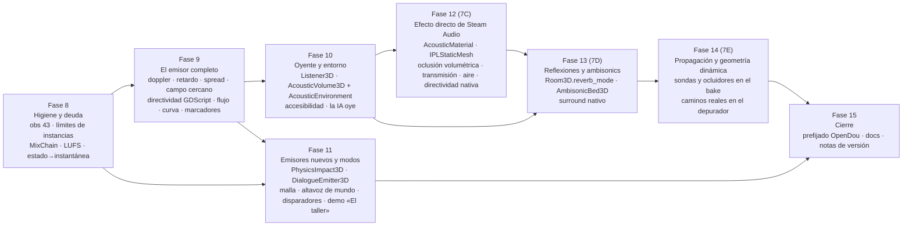

# Hoja de ruta del sprint: de la Fase 7B al sonido AAA

**Fecha:** 2026-09-02 · **Punto de partida:** Fase 7B implementada (binaural para todas las voces, 1107 aserciones) · **Fuentes:** [`docs/funcionalidades.md`](../funcionalidades.md), [`docs/ideas/nodos-de-escena.md`](../ideas/nodos-de-escena.md) (secciones D, F, G y H)

Este documento ordena **todo lo acordado** en fases que se pueden ejecutar una detrás de otra
sin que ninguna dependa de algo que aún no existe. Cada fase sigue el mismo ciclo que las
anteriores: spec → plan → ejecución inline con puntos de control → suite verde → observaciones
en `AGENTS.md`. Ninguna funcionalidad entra sin su aserción sobre audio capturado, con control.

La regla de orden es una sola: **primero lo que repara o desbloquea, después lo que se oye
más por menos, y al final lo que cuesta más y necesita a lo anterior**. Las fases nativas de
Steam Audio (12 a 14) van tras las de GDScript y exports (8 a 11) porque las primeras las
necesitan como cimiento (materiales, oyente, volúmenes) y porque el jugador oye antes la
mejora barata que la cara.

---

## 0. Antes de empezar

| Paso | Qué | Por qué |
|---|---|---|
| 0.1 | Decidir la rama: `main` está en el commit de la interfaz y toda la Fase 7 vive en `aaa`. `git checkout main && git merge --ff-only aaa` la pone al día sin conflictos | El proyecto trabaja en una sola rama y hoy no es así |
| 0.2 | Probar la Fase 7B con audífonos en «Una casa canta» y anotar lo que se oiga mal | Todo lo que sigue se construye encima; si el binaural no convence, se corrige antes |

---

## Fase 8 — Higiene y deuda: la mezcla limpia

**Tamaño:** M · **Depende de:** nada · **Todo GDScript**

Lo que repara promesas y lo que protege todo lo demás. Sin nodos nuevos.

| # | Entrega | Detalle | Se afirma |
|---|---|---|---|
| 8.1 | **Observación 43 arreglada** | La carrera entre `StreetDoor._ready()` poniendo `open_factor = 0` y el despachador de caminos hace intermitente el test de «Una casa canta». Se elimina la carrera (el portal nace cerrado si su puerta lo está), no se relaja el test | Diez corridas seguidas verdes |
| 8.2 | **Límites de instancias con alcance (G4)** | `max_instances` lleva declarado en `AudioEventDef` desde el principio y nadie lo aplica. Se implementa, y se añaden `max_instances_per_emitter` y `max_instances_in_radius` + `instance_radius_m`, con política `REJECT_NEW / STEAL_OLDEST / STEAL_QUIETEST / STEAL_FARTHEST` y fundido de salida, en `post_event` | Con `max_instances = 3`, nunca suenan cuatro voces del evento en el bus; con radio 5 m, dos emisores a 1 m no suman una tercera y uno a 50 m sí suena |
| 8.3 | **Cadena de masterización como recurso** | Recurso `MixChain` (compresor + limitador de Godot con presets juego / cinemática / móvil) que el autoload instala en Master al arrancar según un ajuste de proyecto. La guarda comprueba el **bus**, no la escena | Dos voces a +6 dB sumadas: el pico de Master no supera 0 dBFS; sin la cadena, lo supera |
| 8.4 | **Medidor LUFS (EBU R128)** | Filtro K y ventanas de 400 ms sobre el bus: sonoridad momentánea, a corto plazo e integrada, y pico verdadero. Se muestra en la consola de mezcla y se expone en el manager | Un tono de calibración de −23 dBFS RMS mide −23 LUFS ±0.5; la guarda de cada demo fija su rango |
| 8.5 | **Vinculación estado → instantánea de mezcla** | Recurso `MixStateBinding` (estado, instantánea, fundido, prioridad) en `GameSyncManager`; sustituye al «disparador de estados de mezcla» y al «planificador de ambiente» como nodos | Al entrar en el estado `LowHealth`, el bus `Music` baja el corte al valor de la instantánea con el fundido configurado |

**Por qué primero.** 8.2 cierra una promesa vacía; 8.3 y 8.4 hacen que a partir de aquí toda
demo tenga una mezcla medible y protegida, y así el resto del sprint se evalúa sobre una base
honesta.

---

## Fase 9 — El emisor completo

**Tamaño:** L · **Depende de:** Fase 8 (8.4 para medir; 8.2 para que las pruebas de muchas voces no se pisen) · **GDScript + cambios acotados en el stream nativo**

Todas son **exports** de `OpenDouEventPlayer3D` (y sus equivalentes en `AudioEventDef` para voces anónimas), más un recurso. Ningún nodo nuevo. Las que tocan el nativo funcionan sin él, peor, o lo dicen en el inspector.

| # | Entrega | Nativo | Fallback sin extensión | Se afirma |
|---|---|---|---|---|
| 9.1 | **Doppler (B2)** | No hace falta: actúa sobre `pitch_scale` | Idéntico | Tono de 1 kHz acercándose a 30 m/s se mide por encima de 1 kHz, alejándose por debajo; con `doppler_enabled = false`, en 1 kHz |
| 9.2 | **Retardo por distancia (B1)** | La línea de retardo crece hasta `max_propagation_delay_sec` (3 s por defecto, ajuste de proyecto por la memoria) | Arranque de la voz con retardo fijo desde la distancia inicial | Emisor a 343 m: el primer transitorio llega ~1 s tras `post_event` |
| 9.3 | **Spread por distancia (G1)** | `spatial_blend` pasa a ser **por voz** en el stream: `blend_global × (1 − spread)`; el ajuste del jugador es un factor, no un valor | Sin efecto (Godot no tiene equivalente); el inspector lo dice | Fuente a 1 m con `spread_radius_m = 10`: ILD e ITD cercanos a cero; a 20 m, los de siempre |
| 9.4 | **Campo cercano (B5)** | Low-shelf de refuerzo e ILD extra por debajo de `near_field_distance_m` | Sin efecto; el inspector lo dice | A 0.2 m frente a 1.0 m a la derecha: más graves y más ILD; con distancia 0, sin cambio |
| 9.5 | **Directividad, versión GDScript (A2)** | No todavía (la nativa llega en la Fase 12) | Coseno elevado a `directivity_power` aplicado al volumen; flecha en la vista 3D | Emisor mirando al oyente frente a de espaldas: caída medible; con `dipole_weight = 0`, ninguna |
| 9.6 | **Flujo direccional del spline** | — | `OpenDouSplineEmitter3D.flow_directivity`: tangente en el punto más cercano como eje de directividad y signo del doppler | Río arriba frente a río abajo: nivel y tono distintos |
| 9.7 | **Curva de atenuación (C3)** | El canal ya calcula la distancia: el stream recibe la ganancia | Modelo `CURVE` en `OpenDouDistanceModel`, en ambos backends | Curva a 0 dB hasta 5 m y −40 dB a 6 m: a 5.5 m cae ~20 dB |
| 9.8 | **Marcadores de audio → señales (H2.3)** | — | `OpenDouWavDecoder` lee el chunk `cue`; la instancia emite `marker_reached(nombre)` al cruzarlo; marcadores autorados también en el grafo | Un WAV con un cue a 0.5 s emite la señal entre 0.48 y 0.53 s de reproducción |

**Orden interno.** 9.1 → 9.7 → 9.2 → 9.3 → 9.4 → 9.5 → 9.6 → 9.8. El doppler primero porque
es lo que más se echa en falta; la curva antes que el retardo porque 9.2 y 9.3 se afirman con
distancias y conviene tener el modelo de distancia cerrado.

---

## Fase 10 — El oyente y el entorno

**Tamaño:** L · **Depende de:** Fase 9 (9.3 y 9.4 para que el oyente tenga qué ajustar; 9.2 para que el medio escale el retardo) · **Dos nodos nuevos, dos recursos**

| # | Entrega | Detalle | Se afirma |
|---|---|---|---|
| 10.1 | **`OpenDouListener3D` (A7)** | Nodo que `OpenDouListenerResolver` prefiere si existe: `head_radius_m` (hoy fijo en C++, pasa a ser parámetro del stream), `hrtf_override` (SOFA por jugador), `output_mode`, y una señal de entrada para orientación externa (giroscopio, VR) | Con `head_radius_m` al doble, el ITD medido a 90° se dobla; con un SOFA distinto, cambia la generación del HRTF |
| 10.2 | **`OpenDouAcousticVolume3D` + recurso `AcousticEnvironment`** | Un `Area3D` con un recurso de secciones opcionales, como `WorldEnvironment` + `Environment`: **medio** (velocidad del sonido → escala el ITD y el retardo, paso-bajo, tono), **viento** (vector y ráfagas), **oclusión parcial** (dB/m y Hz/m medidos a lo largo del rayo que ya existe), **descarte** (categorías que se virtualizan sin gastar rayos), **superficie** (`SurfaceType` con prioridad para las pisadas). Sustituye a cinco nodos propuestos | Oyente dentro de un volumen «agua»: ITD a 90° cae a menos de un quinto y la banda alta del bus cae; emisor tras 4 m de «follaje» a 3 dB/m: −12 dB; pisada dentro del «charco»: rama `Water` |
| 10.3 | **Accesibilidad (H2.4)** | Ajustes del jugador junto a los de espacialización: mezcla mono, compresión de rango dinámico («modo noche», sobre la cadena de 8.3), y un nodo HUD opcional `OpenDouSoundIndicator` que dibuja la dirección de los sonidos importantes (reutiliza lo que el radar ya sabe) | Con mono activo, ILD medida 0 dB; con el modo noche, el rango entre pico y valle de una demo baja al menos 6 dB |
| 10.4 | **La IA oye (H2.1)** | `manager.get_loudness_at(position)` reutilizando oclusión y grafo de salas hacia un punto cualquiera, y `OpenDouAIHearing3D` (`Node3D` con umbral) que emite `sound_heard(event, loudness, from_position)` | Emisor tras una pared: la sonoridad en el punto del guardia es menor que sin pared, y sube al abrir la puerta |

**Orden interno.** 10.1 → 10.2 → 10.3 → 10.4. El oyente primero porque el medio (10.2) escala
sus parámetros; la IA al final porque es lo único que no cambia lo que el jugador oye.

---

## Fase 11 — Emisores nuevos y modos

**Tamaño:** L · **Depende de:** Fase 9 (9.8 marcadores para el diálogo; 9.5 directividad para el altavoz) y Fase 8 (8.2 para los impactos, que disparan muchas voces) · **Dos nodos nuevos, tres modos**

| # | Entrega | Detalle | Se afirma |
|---|---|---|---|
| 11.1 | **`OpenDouPhysicsImpact3D` (G3)** | Hijo de un `RigidBody3D`: intercepta `body_entered`, lee `SurfaceType` de ambos cuerpos, velocidad relativa normal y masa, y postea con RTPC `ImpactForce` e `ImpactMass` y el switch de material; umbral y recarga | Choques a 2 y 8 m/s: `ImpactForce` cuatro veces mayor y rama `Metal` si el otro cuerpo lo declara; bajo el umbral, nada |
| 11.2 | **`OpenDouDialogueEmitter3D`** | Nodo sobre `AudioDialogueManager`: una línea por idioma, `subtitle_changed`, ducking absoluto, `mouth_amplitude` por frame (envolvente de `AudibleVoiceMonitor`) y visemas **autorados** por marcadores (9.8). Sin fonemas automáticos, y lo dice | Al reproducir una línea, la señal de subtítulo llega con su texto, la música baja el valor configurado, y `mouth_amplitude` sigue la envolvente del WAV |
| 11.3 | **Emisor de malla como modo (G2)** | `OpenDouMultiPositionEmitter3D.source_mode = {POINTS, MESH}`: BVH sobre los triángulos al entrar en el árbol; cada frame, el punto de la malla más cercano al oyente con histéresis | Plano de 1000 triángulos: el origen aparente sigue al oyente a menos de una arista; coste por frame bajo techo |
| 11.4 | **Altavoz de mundo como modo (B6)** | `OpenDouEventPlayer3D.source = BUS_CAPTURE` con `capture_bus`: `AudioEffectCapture` → `AudioStreamGenerator` como fuente de la voz; el bus origen se silencia en la salida directa. Sirve también para voz de red (H2.5) | Un tono que suena solo en `Radio` aparece en el bus del emisor con la ILD de su posición |
| 11.5 | **Disparadores en `OpenDouParameterArea3D` (C6)** | Exports `trigger_event`, `trigger_probability`, `trigger_cooldown`, `trigger_once`, filtro por grupo | Un cuerpo del grupo `player` entra: suena una vez y respeta la recarga; otro grupo no dispara |
| 11.6 | **Demo «El taller»** | Escena nueva que ejercita 11.1 a 11.5: objetos que caen, un mecánico que habla, una radio de taller, un motor con `BlendContainer` granular por `RPM` y `Load` (la plantilla de vehículo, como demo y preset del grafo, no como nodo) | Guardas de composición y aserciones de la escena, como las cuatro demos actuales |

---

## Fase 12 — Efecto directo de Steam Audio (la antigua 7C)

**Estado:** ✅ implementada (2026-09-03); correcciones en §11 de su spec.

**Tamaño:** XL · **Depende de:** Fase 10 (10.2: el recurso `AcousticEnvironment` y el volumen son el sitio natural de los materiales; 10.1: el oyente) y Fase 9 (9.5: la directividad nativa sustituye a la aproximación) · **Nativo**

| # | Entrega | Detalle | Se afirma |
|---|---|---|---|
| 12.1 | **Recurso `AcousticMaterial` (A1)** | Absorción, dispersión y transmisión **por banda**; los ocho presets de `AcousticMaterialRegistry` como punto de partida; asignable al `MeshInstance3D` o al registro del bake | Carga y serialización; el registro lo expone |
| 12.2 | **El bake alimenta a Steam Audio** | `OpenDouAcousticGeometryBake` vuelca triángulos y materiales a `IPLStaticMesh` + `IPLMaterial` en una `IPLScene` | Conteo de triángulos igual al del bake; la escena se crea y se libera sin fugas |
| 12.3 | **`IPLDirectEffect` en la cadena** | Oclusión volumétrica (una ventana tapa parcialmente), transmisión en tres bandas por material, absorción del aire, y directividad nativa (sustituye a 9.5 cuando la extensión está). `OcclusionManager` queda como fallback | La misma voz tras `Glass` y tras `Concrete`: espectros distintos; tras nada, igual al directo. A 200 m, la banda alta cae por el aire |
| 12.4 | **Presupuesto de simulación** | El `AcousticLODController` decide qué voces piden efecto directo con rayos y cuáles solo atenuación; medida en el banco y en la guarda de DSP | Con 64 voces, el coste queda bajo el techo escrito |

---

## Fase 13 — Reflexiones y ambisonics (la antigua 7D)

**Estado:** ✅ implementada (2026-09-03); correcciones en §11 de su spec.

**Tamaño:** XL · **Depende de:** Fase 12 (la escena de Steam Audio y los materiales) · **Nativo**

| # | Entrega | Detalle | Se afirma |
|---|---|---|---|
| 13.1 | **`OpenDouRoom3D.reverb_mode = {SABINE, CONVOLUTION}` (A6)** | Con `CONVOLUTION`, respuesta al impulso trazada contra la geometría real, centrada en el oyente; `OpenDouIRRT60Analyzer` deriva el RT60 real y alimenta el fallback de Sabine | La IR de la sala de metal tiene T20 más largo que la de madera con el mismo volumen; sin extensión, el pool de Sabine recibe el RT60 derivado |
| 13.2 | **`OpenDouAmbisonicBed3D` + `OpenDouAmbisonicStream` (A3)** | Archivo ambisónico de orden 1 o 2 o cama estéreo codificada; rotación con el oyente y decodificación al HRTF | Girar al oyente 90° cambia el signo de la ILD de una fuente codificada al frente |
| 13.3 | **Salida surround del backend nativo (H2.7)** | Con la decodificación ambisónica a altavoces (`IPLAmbisonicsPanningEffect`), el modo altavoces deja de ser estéreo cuando el dispositivo es 5.1 o 7.1 | Fuente detrás: energía en los canales traseros; delante, en los frontales |
| 13.4 | **Retirada de `ReflectionDispatcher` como fuente de verdad** | Los `OpenDouReflector3D` quedan como ajuste artístico sobre la convolución | La suite de reflexiones sigue verde con el nuevo camino |

---

## Fase 14 — Propagación y geometría dinámica (la antigua 7E)

**Estado:** ✅ implementada (2026-09-03); correcciones en §11 de su spec.

**Tamaño:** XL · **Depende de:** Fase 12 (escena estática) y Fase 13 (el hilo de simulación) · **Nativo**

| # | Entrega | Detalle | Se afirma |
|---|---|---|---|
| 14.1 | **Sondas dentro del bake (A4)** | `OpenDouAcousticGeometryBake` gana un volumen de sondas con espaciado, botón de bake y archivo `.probes` versionable; el efecto de caminos da atenuación, dirección y retardo. Los portales autorados ganan; las sondas cubren el resto | Emisor tras una esquina sin portal: la voz llega con su dirección aparente en la esquina |
| 14.2 | **Ocluidores dinámicos dentro del bake (A5)** | Grupo `AcousticObstacleDynamic`: mallas registradas como `IPLInstancedMesh` y seguidas por transform con umbral | Puerta a 45°: oclusión intermedia; quieta, sin actualizaciones |
| 14.3 | **El depurador dibuja los caminos reales** | `OpenDouAcousticDebugger3D` usa el callback de visualización de Steam Audio | Estructura y ausencia de errores |
| 14.4 | **Retirada de `EdgeDiffractionEngine` y `RoomCouplingEngine`** | Sustituidos por la propagación; sus tests se convierten | Suite verde |

---

## Fase 15 — Cierre del sprint

**Tamaño:** M · **Depende de:** todas

| # | Entrega |
|---|---|
| 15.1 | **Prefijado `OpenDou` (la antigua 4B)**: las ~60 clases del addon sin prefijo lo ganan; las de `scenes/` se quedan sin él. Al final para renombrar una sola vez sobre el código ya escrito |
| 15.2 | **`docs/funcionalidades.md` al día** con todo lo nuevo y sus marcas de estado reales, y el diagrama de arquitectura con el efecto directo, las reflexiones y las sondas |
| 15.3 | **Notas de versión** y actualización de `README.md`, `AGENTS.md` (observaciones acumuladas) y `docs/tasks/current.md` |

**Estado (2026-09-03):** 15.2 y 15.3 al día en `funcionalidades.md`, `AGENTS.md` y `current.md`;
15.1 (prefijado) y las notas de versión / `README.md` siguen pendientes.

---

## Fases añadidas al sprint (2026-09-03)

| Fase | Entrega | Estado |
|---|---|---|
| **15 (deudas)** | C1 envío propio de reverb en `steam_audio`, C3 spline y multiposición en el sistema de voces, C4 LUFS nativo, C5 latencia del altavoz de mundo (107 ms). Spec [`fase15`](../superpowers/specs/2026-09-03-fase15-deudas-design.md) | ✅ |
| **16 («La presa»)** | La escena grande: valle, presa, nave `CONVOLUTION`, cabina de cristal, galería en L con sondas, galería inundada, compuerta dinámica, río, camión, tormenta, vigilantes que oyen; los 21 tipos de nodo salvo el 2D (C2). Spec [`fase16`](../superpowers/specs/2026-09-03-fase16-la-presa-design.md) | ✅ |

---

## Fuera de este sprint, por escrito

| Qué | Por qué |
|---|---|
| CI, Windows, Linux, Android, iOS, web | Decisión previa: compilación local; entra cuando la arquitectura nativa deje de moverse (tras la Fase 14) |
| Dos oyentes (pantalla partida) | Godot tiene una salida; no hay solución limpia para audífonos. Límite conocido |
| Fonemas automáticos para visemas | Godot no los trae; el diálogo da envolvente y marcadores autorados |
| Controlador de vehículos como nodo | Es una demo y un preset del grafo (11.6), no física de un género dentro del plugin |

---

## Grafo de dependencias

Las fases 11 y 12 son independientes entre sí: si hay dos personas, una puede hacer los
emisores nuevos mientras la otra empieza el efecto directo. Con una sola, el orden es el de
los números.

---

## Reglas del sprint

1. Una fase no empieza hasta que la anterior tiene la suite verde, las fugas bajo techo, el
   coste en el banco y sus observaciones en `AGENTS.md`.
2. Cada fase tiene spec y plan propios; las correcciones que la ejecución obligue a hacer se
   anotan en el spec, como en la 7B (§15).
3. Todo lo que dependa del nativo funciona sin él, aunque sea peor, o dice en el inspector que
   necesita el backend `steam_audio`. La suite se omite **y lo dice** cuando la extensión no
   está.
4. Nada de lo que aquí se promete se afirma en `docs/funcionalidades.md` hasta que su
   aserción esté en la suite.
