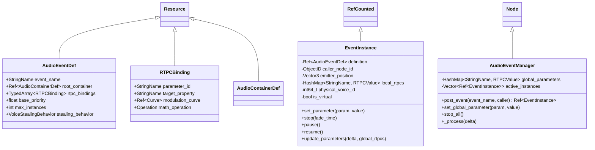

# Technical Specification: Event & Action Dispatcher (OpenDou Core)

**Module:** `core/events/`, `addons/opendou/runtime/`
**Status:** Approved / In Progress
**Reference Document:** [docs/architecture/event-dispatcher.md](file:///c:/Users/Danielillo/projects/godot%20plugins/opendou/docs/architecture/event-dispatcher.md)

---

## 1. Objective & Scope

The **Event & Action Dispatcher** is the entry point for all audio execution in OpenDou. It completely decouples game code from Godot's scene tree by translating event requests (`OpenDou.post_event("Event_Name", target)`) into a sequence of atomic audio actions, evaluating real-time modulation parameters (RTPC), and managing runtime `EventInstance` lifecycles.

---

## 2. Architecture & Data Structures

---

## 3. Key Technical Invariants

### 3.1. Slew-Rate Interpolation (`RTPCValue`)
To eliminate zipper noise and audio pop artifacts when parameters change abruptly:
$$\text{current} = \text{current} \pm (\text{speed} \times \Delta t)$$
Each parameter defines configurable `attack_speed` and `release_speed` (units/second).

### 3.2. Built-in Automatic Parameters
`AudioEventManager` automatically computes and updates spatial parameters for any `EventInstance` attached to a 3D/2D node:
* `BuiltIn::Distance`: Euclidean distance to active listener.
* `BuiltIn::EmitterAngle`: Directional angle relative to listener orientation.
* `BuiltIn::RelativeVelocity`: Relative speed for Doppler pitch shifting.

### 3.3. Dual Backend (GDScript Engine Facade & GDExtension Core)
* Pure GDScript Resources allow testing in-editor and rapid prototyping.
* C++ GDExtension core handles heavy per-frame mathematical interpolation and curve evaluations (`modulation_curve->sample_baked()`) for hundreds of instances with near-zero CPU cost.

---

## 4. Acceptance Criteria (DoD)

1. **`AudioEventDef` & `RTPCBinding` Resources:** Fully inspectable in Godot with curve editor support.
2. **`EventInstance` Lifecycle:** Creation, parameter setting, interpolation, playback, stopping, and cleanup.
3. **`AudioEventManager` Singleton:** Accessible via `OpenDou.post_event()` from any script.
4. **Automated Unit Tests:** Headless tests validating parameter interpolation, curve sampling, and instance lifecycle.
