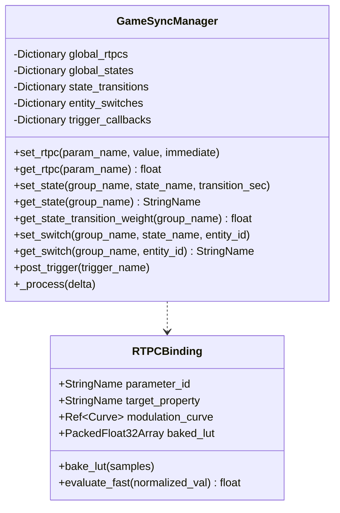

# Technical Specification: Centralized Game Syncs Manager & $O(1)$ LUT Curve Acceleration (OpenDou Core)

**Module:** `addons/opendou/runtime/`, `addons/opendou/resources/`
**Status:** Approved / In Progress
**Reference Document:** [docs/ideas/006-gestor-central.md](file:///c:/Users/Danielillo/projects/godot%20plugins/opendou/docs/ideas/006-gestor-central.md)

---

## 1. Objective & Scope

The **Game Syncs Manager** is the unified hub for all contextual game variables that drive audio behavior:
1. **RTPCs (Real-Time Parameter Controls):** Continuous floating-point variables with independent attack/release slew rates.
2. **States:** Global discrete game states (`GameState = InCombat`, `Zone = Cave`, `PlayerAlive = False`) with smooth cross-fade transition durations.
3. **Switches:** Entity-scoped discrete context variables (`SurfaceType = Metal`, `ArmorMaterial = Kevlar`).
4. **Triggers:** Instantaneous musical cues and stingers.
5. **$O(1)$ LUT Curve Evaluation:** Pre-baked 256/512 lookup tables for constant-time modulation without Bezier polynomial calculation overhead.

---

## 2. Architecture & Data Structures

---

## 3. $O(1)$ Lookup Table (LUT) Baking Model

When an `RTPCBinding` initializes or bakes:
1. Allocates a `PackedFloat32Array` with $N$ entries (default 256 samples).
2. Samples the curve at equidistant intervals $t \in [0.0, 1.0]$:
   $$\text{LUT}[i] = \text{modulation\_curve.sample\_baked}\left(\frac{i}{N - 1}\right)$$
3. Runtime evaluation executes in $O(1)$ memory lookup:
   $$\text{index} = \text{clamp}\left(\lfloor \text{norm\_value} \times (N - 1) \rfloor, 0, N - 1\right)$$
   $$\text{value} = \text{LUT}[\text{index}]$$

---

## 4. Acceptance Criteria (DoD)

1. **RTPC Slew-Rate:** Changes interpolate smoothly without audio clicks.
2. **State Transitions:** State changes cross-fade over specified duration $t > 0$.
3. **Entity Switches:** Local entity switches cleanly override global state defaults.
4. **LUT Performance:** LUT evaluation delivers accurate output in $O(1)$ operations.
5. **100% Automated Tests:** Complete unit test suite in `tests/test_game_syncs.gd`.
