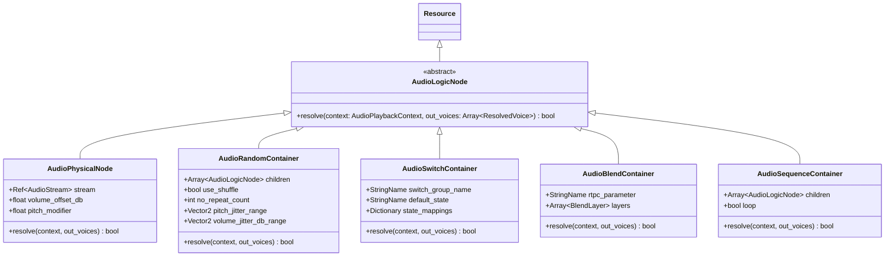

# Technical Specification: Audio Logic Containers (OpenDou Core)

**Module:** `addons/opendou/resources/containers/`, `addons/opendou/runtime/`
**Status:** Approved / In Progress
**Reference Document:** [docs/architecture/logic-container.md](file:///c:/Users/Danielillo/projects/godot%20plugins/opendou/docs/architecture/logic-container.md)

---

## 1. Objective & Scope

Audio Logic Containers implement the **Decision Tree** of OpenDou. Utilizing the **Composite Pattern**, containers can be nested infinitely (e.g. a `SwitchContainer` for surface materials containing multiple `RandomContainers`, which in turn contain `BlendContainers`).

When an event is posted, the root container resolves the current `AudioPlaybackContext` (RTPCs and Switches) into an array of concrete `ResolvedVoice` objects with calculated volume offsets and pitch modifiers.

---

## 2. Class Hierarchy Diagram



---

## 3. Data Structures

### 3.1. `AudioPlaybackContext`
Injected by `EventManager` / `EventInstance` when evaluating the decision tree:
```gdscript
class_name AudioPlaybackContext
extends RefCounted

var rtpc_values: Dictionary = {}      # StringName -> float
var switch_states: Dictionary = {}    # StringName -> StringName
```

### 3.2. `ResolvedVoice`
The resolved physical voice ready for the voice manager and audio server:
```gdscript
class_name ResolvedVoice
extends RefCounted

var stream: AudioStream
var volume_offset_db: float = 0.0
var pitch_modifier: float = 1.0
```

---

## 4. Acceptance Criteria (DoD)

1. **Composite Resolution:** Any logic container tree resolves predictably to 1 or more `ResolvedVoice` objects.
2. **Shuffle & No-Repeat:** `AudioRandomContainer` guarantees that previous $N$ items are not repeated consecutively.
3. **Switch Mapping:** `AudioSwitchContainer` correctly routes to mapped branch or fallback default state.
4. **Blend Crossfading & Silence Culling:** `AudioBlendContainer` evaluates curve outputs for all layers and culls silent layers ($\le -80\text{ dB}$).
5. **Headless Unit Tests:** 100% test coverage for all container types without requiring audio hardware.
