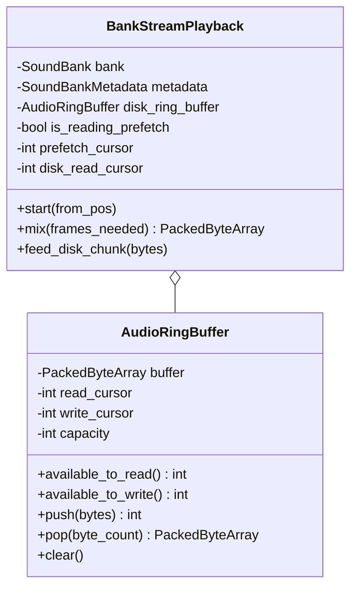

# Technical Specification: Lock-Free Audio RingBuffer & Prefetch-to-Disk Stitching (OpenDou Core)

**Module:** `addons/opendou/runtime/`
**Status:** Approved / In Progress
**Reference Document:** [docs/ideas/009.md](file:///c:/Users/Danielillo/projects/godot%20plugins/opendou/docs/ideas/009.md)

---

## 1. Objective & Scope

This specification defines the zero-latency audio playback pipeline:
1. **AudioRingBuffer (SPSC):** Single-Producer Single-Consumer circular buffer managing disk stream chunk transfers.
2. **Buffer Handshake & Stitching:** Seamless transition from instantaneous RAM prefetch attack buffers to streamed disk bodies.
3. **Buffer Underrun Protection:** Graceful zero-fill / silence injection when disk I/O throughput is temporarily starved, preventing audio corruption or loud pops.

---

## 2. Architecture & Data Structures



---

## 3. Stitching State Machine

```text
[ start() ] ──▶ Phase 1: Read from RAM Prefetch Slice
                        │ (Instant Zero-Latency Start)
                        ▼
                Prefetch Exhausted (prefetch_cursor >= prefetch_length)
                        │ (Seamless Handshake / Zero-Crossing)
                        ▼
                Phase 2: Read from Disk RingBuffer
                        │
       ┌────────────────┴────────────────┐
       ▼                                 ▼
[ Data Available ]             [ Buffer Underrun ]
Pop from RingBuffer            Inject Silence (0x00)
```

---

## 4. Acceptance Criteria (DoD)

1. `AudioRingBuffer` accurately tracks read/write cursors, wrapping around `capacity` without data loss or corruption.
2. `BankStreamPlayback` mixes prefetch data first, transitioning to ring buffer data with byte-perfect continuity.
3. Buffer underruns output exact silence bytes without throwing exceptions or memory faults.
4. 100% automated test coverage in `tests/test_ringbuffer.gd`.
