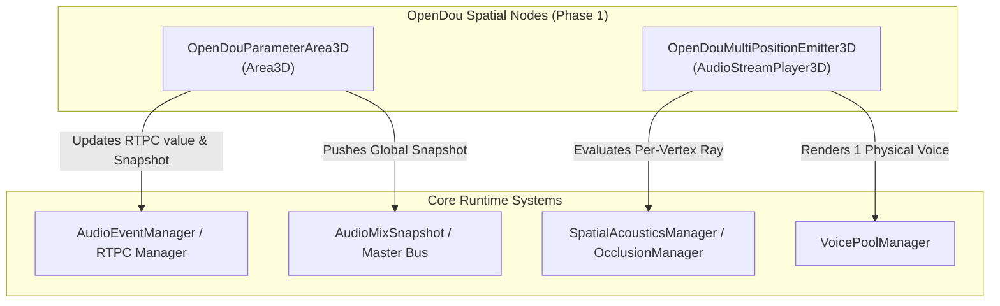

# Technical Specification: Spatial Gameplay Nodes & Dynamic Modulation (Phase 1)

* **Document ID:** `SPEC-SPATIAL-NODES-PHASE1`
* **Module:** `addons/opendou/nodes/`
* **Target Version:** OpenDou 1.0 (Godot 4.x)
* **Date:** 2026-08-31
* **Status:** Approved / In Implementation

---

## 1. Executive Summary

This specification defines the architecture, API, and algorithmic behavior for Phase 1 of OpenDou's Advanced Spatial Nodes Suite:
1. **`OpenDouParameterArea3D`:** Volumetric parameter modulation zone (`Area3D`) that continuously maps listener or emitter physical penetration depth, axis gradients, and bounding boxes to global/local RTPC parameters, sidechain snapshots, and auxiliary bus sends.
2. **`OpenDouMultiPositionEmitter3D`:** Large acoustic object emitter (`AudioStreamPlayer3D`) that binds a single audio voice to multiple spatial emission vertices with per-vertex occlusion, phase comb-filtering suppression, dynamic mesh vertex extraction, and interior volume envelopment.

---

## 2. Architecture & Component Design



---

## 3. Node Specifications

### 3.1. `OpenDouParameterArea3D`

Extends `Area3D`. Modulates game parameters and mix states as entities enter, traverse, or exit acoustic volumes.

#### 3.1.1. Exported Properties (`@export`)

| Group | Property | Type | Default | Description |
|---|---|---|---|---|
| **RTPC Parameter** | `parameter_name` | `StringName` | `&""` | Target RTPC parameter identifier to modulate in `AudioEventManager`. |
| | `interpolation_mode` | `int (Enum)` | `0` | `0: CENTER_RADIAL`, `1: AXIS_GRADIENT`, `2: BINARY_TRIGGER`. |
| | `modulation_curve` | `Curve` | `null` | Non-linear mapping curve ($x \in [0, 1] \to y \in [0, 1]$). |
| | `min_value` | `float` | `0.0` | Output RTPC value at minimum penetration ($t = 0.0$). |
| | `max_value` | `float` | `1.0` | Output RTPC value at maximum penetration ($t = 1.0$). |
| | `gradient_axis` | `Vector3` | `Vector3(0, 1, 0)` | Local coordinate direction vector for `AXIS_GRADIENT` mode. |
| | `ignore_y_axis` | `bool` | `false` | When true, projects radial distance onto the 2D XZ plane (cylindrical zone). |
| **Conflict & Blending**| `priority` | `int` | `0` | Execution priority when multiple areas share the same `parameter_name`. |
| | `blend_operation` | `int (Enum)` | `0` | `0: MAX` (highest value wins), `1: ADD` (summed and clamped), `2: REPLACE` (higher priority overwrites). |
| **Global Mix Snapshots**| `target_snapshot` | `StringName` | `&""` | Snapshot name to activate when the listener enters the zone. |
| **Transitions & Physics**| `fade_in_time` | `float` | `0.5` | Attack time in seconds when entering or increasing parameter value. |
| | `fade_out_time` | `float` | `0.8` | Release time in seconds when exiting the volume. |
| | `edge_hysteresis_ms` | `float` | `150.0` | Debounce window in ms to prevent boundary rapid-flickering. |
| | `affects_emitters_inside`| `bool` | `true` | When true, modulates auxiliary sends/filters for emitters situated inside the volume. |
| | `target_entity_mask` | `int (Mask)`| `1` | Physics collision layer mask to detect listener or target bodies. |

#### 3.1.2. Mathematical Formulations

1. **Center Radial Penetration ($t_{\text{radial}}$):**
   Given listener position $\vec{P}_{\text{listener}}$, volume center $\vec{C}_{\text{area}}$, and bounding extents $\vec{E}$:
   $$d = \|\vec{P}_{\text{listener}} - \vec{C}_{\text{area}}\| \quad (\text{or } d = \|(\vec{P} - \vec{C})_{xz}\| \text{ if } \text{ignore\_y\_axis}=\text{true})$$
   $$R_{\text{max}} = \max(E_x, E_z) \quad \implies \quad t_{\text{radial}} = \text{clamp}\left(1.0 - \frac{d}{R_{\text{max}}}, 0.0, 1.0\right)$$

2. **Axis Gradient Penetration ($t_{\text{axis}}$):**
   Given unit axis $\hat{u} = \frac{\vec{A}}{\|\vec{A}\|}$ and bounding range $[-\frac{L}{2}, \frac{L}{2}]$:
   $$x_{\text{proj}} = (\vec{P}_{\text{listener}} - \vec{C}_{\text{area}}) \cdot \hat{u}$$
   $$t_{\text{axis}} = \text{clamp}\left(\frac{x_{\text{proj}} + L/2}{L}, 0.0, 1.0\right)$$

3. **Value Mapping:**
   $$V_{\text{target}} = V_{\text{min}} + (V_{\text{max}} - V_{\text{min}}) \cdot \text{EvaluateCurve}(t)$$

4. **Despawn & Scene-Change Safety:**
   Upon `body_entered` (or `area_entered`), the node connects to `target.tree_exited`. If triggered before exit, it automatically forces a release of `target_snapshot` and resets the RTPC parameter.

---

### 3.2. `OpenDouMultiPositionEmitter3D`

Extends `AudioStreamPlayer3D`. Represents large or distributed physical sound sources (trains, rivers, factory conveyor belts, pipeline arrays) using a single physical audio stream.

#### 3.2.1. Exported Properties (`@export`)

| Group | Property | Type | Default | Description |
|---|---|---|---|---|
| **Multi-Position** | `emission_points` | `Array[Vector3]` | `[Vector3.ZERO]` | Array of local vertex offsets representing secondary acoustic emitters. |
| | `rendering_mode` | `int (Enum)` | `0` | `0: CLOSEST_POINT_TRACKING`, `1: MULTI_POINT_BLENDED`. |
| | `smooth_position_lag` | `float` | `0.1` | Damping time constant $\tau$ for smooth spatial tracking between vertices. |
| **Phase & Envelopment** | `random_phase_offset` | `bool` | `true` | Adds micro-delays ($\Delta t \in [0.1, 2.5]\text{ ms}$) and micro-pitch detuning ($\pm 3\text{ cents}$) to eliminate comb filtering. |
| | `envelopment_on_inside` | `bool` | `true` | Automatically transitions the audio to diffuse non-directional 2D when the listener is inside the vertex convex hull/AABB. |
| **Acoustic Occlusion** | `cull_distance` | `float` | `50.0` | Maximum audibility distance evaluated against the closest vertex. |
| | `vertex_occlusion` | `bool` | `true` | Computes physical raycast occlusion from the **active frame vertex** directly to the listener (bypassing the central node origin). |

#### 3.2.2. Public Scripting API

```gdscript
func add_emission_point(local_pos: Vector3) -> int
func remove_emission_point(index: int) -> void
func clear_emission_points() -> void
func set_emission_points(points: Array[Vector3]) -> void
func get_closest_point_to(global_target: Vector3) -> Vector3
func update_points_from_mesh(mesh_instance: MeshInstance3D, sample_step: int = 8) -> void
```

#### 3.2.3. Closest-Point vs. Multi-Point Blended DSP

1. **Closest Point Tracking:**
   $$\vec{V}_{\text{active}} = \arg\min_{\vec{V}_i \in \text{emission\_points}} \|\vec{V}_{i,\text{global}} - \vec{P}_{\text{listener}}\|$$
   $$\vec{P}_{\text{render}}(t) = \vec{P}_{\text{render}}(t-\Delta t) + \frac{\Delta t}{\tau + \Delta t} \cdot (\vec{V}_{\text{active}} - \vec{P}_{\text{render}}(t-\Delta t))$$

2. **Multi-Point Blended Gain & Position:**
   $$w_i = \text{clamp}\left(1.0 - \frac{\|\vec{V}_{i,\text{global}} - \vec{P}_{\text{listener}}\|}{d_{\text{max}}}, 0.0, 1.0\right)^2$$
   $$\vec{P}_{\text{blended}} = \frac{\sum w_i \cdot \vec{V}_{i,\text{global}}}{\sum w_i + \epsilon}, \quad G_{\text{composite}} = \min\left(1.0, \sum w_i\right)$$

3. **Comb-Filtering Suppression:**
   In `MULTI_POINT_BLENDED` mode with `random_phase_offset = true`, a small pseudo-random delay offset and micro-pitch shift ($\Delta f = f \cdot 2^{\frac{\delta}{1200}}$) is modulated per active vertex to eliminate phase cancelation.

---

## 4. Verification & Testing Plan

### 4.1. Automated Unit & Integration Tests

* **Suite 1: `tests/test_parameter_area_3d.gd` (10 tests)**
  1. `test_radial_penetration_calculation()`
  2. `test_axis_gradient_calculation()`
  3. `test_binary_trigger_with_fade()`
  4. `test_ignore_y_axis_cylindrical_projection()`
  5. `test_priority_and_max_blend_operation()`
  6. `test_priority_and_replace_blend_operation()`
  7. `test_target_snapshot_push_and_release()`
  8. `test_target_despawn_tree_exited_safety()`
  9. `test_boundary_hysteresis_debouncing()`
  10. `test_affects_emitters_inside_modulation()`

* **Suite 2: `tests/test_multi_position_emitter_3d.gd` (8 tests)**
  1. `test_closest_point_tracking_position()`
  2. `test_multi_point_blended_weights_and_gain()`
  3. `test_envelopment_transition_inside_aabb()`
  4. `test_vertex_occlusion_raycast_origin()`
  5. `test_add_remove_clear_emission_points_api()`
  6. `test_update_points_from_mesh_instance()`
  7. `test_comb_filtering_phase_offset_generation()`
  8. `test_cull_distance_boundary()`

### 4.2. Acceptance Criteria (DoD)
* 100% of tests in `test_parameter_area_3d.gd` and `test_multi_position_emitter_3d.gd` pass with `godot --headless`.
* Zero audio clicks or pops when crossing vertices or entering/exiting parameter areas.
* Full registration of both nodes and custom SVG icons in `addons/opendou/plugin.gd`.
