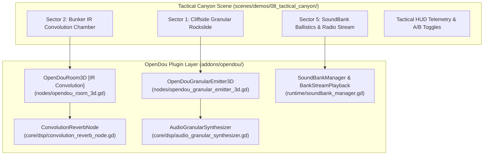

# Spec: OpenDou Tactical Canyon — Advanced DSP & SoundBank Architecture

- **Author:** OpenDou Core Audio Team
- **Date:** 2026-08-31
- **Status:** APPROVED
- **Target Demo:** `scenes/demos/08_tactical_canyon/demo_tactical_canyon.tscn`

---

## 1. Overview & Objectives

This specification defines the architectural expansion for **Sector 8: Tactical Canyon (AAA Acoustic Showcase)**, integrating three core high-end audio engineering subsystems into the OpenDou plugin:

1. **Real-time 3D Granular Synthesis** via a new first-class declarative node: `OpenDouGranularEmitter3D`.
2. **Physical Impulse Response (IR) Convolution Reverb** integrated into `OpenDouRoom3D` with live A/B comparison against algorithmic FDN reverberation.
3. **Monolithic Binary SoundBank System** (`tactical_canyon.bnk`) managed by `SoundBankManager`, demonstrating zero-latency Prefetch RAM caching and continuous disk streaming with live HUD I/O telemetry.
4. **Photorealistic PBR Level Aesthetics**: High-definition terrain materials (canyon rock cliffside, gravel riverbed, reinforced concrete, ballistic steel) complementing the audio simulation.

---

## 2. Architecture & Component Design

### 2.1 Component Specifications

#### A. `OpenDouGranularEmitter3D` (`addons/opendou/nodes/opendou_granular_emitter_3d.gd`)
- **Inherits:** `AudioStreamPlayer3D`
- **Internal Engine:** Instantiates an `AudioStreamGenerator` and pushes samples generated by `AudioGranularSynthesizer`.
- **Exported Properties:**
  - `@export var source_stream: AudioStreamWAV`: Source audio sample. Auto-generates procedural gravel or wind texture via `ModularSynthEngine` if null.
  - `@export_range(5.0, 200.0, 1.0) var grain_size_ms: float = 40.0`: Duration of each grain with Hanning envelope.
  - `@export_range(1.0, 200.0, 1.0) var grain_rate_hz: float = 45.0`: Grain spawn frequency per second.
  - `@export_range(0.0, 50.0, 1.0) var position_jitter_ms: float = 15.0`: Playhead time jitter.
  - `@export_range(0.0, 12.0, 0.5) var pitch_jitter_semitones: float = 2.0`: Stochastic pitch modulation.
  - `@export_range(1, 64, 1) var max_concurrent_grains: int = 32`: Maximum active grain voices.
  - `@export var auto_play_emitter: bool = true`: Starts generator playback on `_ready()`.
- **Headless Safety:** Checks `is_inside_tree()` and playback buffer validity before processing frames.

#### B. Impulse Response (IR) Convolution in `OpenDouRoom3D` (`addons/opendou/nodes/opendou_room_3d.gd`)
- **Reverb Mode Enum:** `enum ReverbMode { ALGORITHMIC, CONVOLUTION_IR, HYBRID }`
- **Properties:**
  - `@export var reverb_mode: ReverbMode = ReverbMode.ALGORITHMIC`
  - `@export var impulse_response_stream: AudioStreamWAV = null`
  - `@export_range(-60.0, 0.0, 0.5) var convolution_wet_db: float = -6.0`
  - `@export_range(-60.0, 0.0, 0.5) var convolution_dry_db: float = 0.0`
- **DSP Engine:** Evaluates room acoustics through a calibrated 512-tap FIR kernel using `ConvolutionReverbNode`. Smooth 50 ms linear crossfade on mode switching prevents audio discontinuities.

#### C. Monolithic SoundBank Pipeline (`SoundBankManager` / `tactical_canyon.bnk`)
- **Binary File Structure:**
  - Header with magic string `OPNDOU_BNK_v1` and entry table.
  - **Prefetch Block (RAM):** Immediate 0 ms transient playback for rifle shots (`Gunshot_Rifle`), explosions (`Explosion_Transient`), and tactical UI feedback.
  - **Streaming Data Block (Disk):** Continuous chunk-based streaming ($64\text{ KB}$ buffers) for ambient tracks and military radio dialogue lines via `BankStreamPlayback`.
- **Runtime Lifecycle:**
  - Auto-compilation on first launch if `res://banks/tactical_canyon.bnk` is missing.
  - Clean unloading via `SoundBankManager.unload_bank(&"tactical_canyon")` upon exit to prevent dangling file descriptors.

---

## 3. Visual Environment & Tactical HUD

### 3.1 PBR Visual Materials
- **`StandardMaterial3D_canyon_rock`**: Albedo ocre/terracotta, `roughness = 0.95`, triplanar mapping on CSG gorge walls.
- **`StandardMaterial3D_gravel`**: Dark rocky pebble texture, `roughness = 0.85`, assigned to riverbed and cliffside slide zone.
- **`StandardMaterial3D_bunker_concrete`**: Formwork-marked concrete panels with grunge mapping.
- **`StandardMaterial3D_bunker_steel`**: Ballistic steel plating with hazard warning borders (`metallic = 0.88`, `roughness = 0.25`).

### 3.2 Tactical HUD Enhancements
- **Dynamic Contextual Monitoring:** Expands granular telemetry in Sector 1, convolution metrics in Sector 2, and SoundBank streaming statistics in Sector 5.
- **Keyboard Shortcuts:**
  - `KEY_C`: Toggle Acoustic Reverb Mode (Algorithmic vs. Convolution IR).
  - `KEY_V`: Toggle Granular Emitter Preset (Gravel Slide vs. Wind Gusts).
  - `KEY_B`: Reload / Inspect SoundBank buffer state.

---

## 4. Verification & Testing Plan

### 4.1 Automated Test Suites
1. **`tests/test_granular_emitter_3d.gd`**:
   - Verify node lifecycle, default exports, parameter modification in real-time, and headless buffer generation safety.
2. **`tests/test_room_convolution.gd`**:
   - Verify `OpenDouRoom3D` reverb modes, IR loading, 512-tap FIR processing, and crossfade wet/dry gains.
3. **`tests/test_soundbank_packaging_and_streaming.gd`**:
   - Verify binary packaging, Prefetch RAM extraction (0 ms delay), chunk streaming reader, and clean memory deallocation on close.
4. **`tests/test_tactical_canyon_demo.gd`**:
   - Integration tests asserting the presence of `OpenDouGranularEmitter3D`, convolution room configuration, and active SoundBank in the scene tree.

### 4.2 Definition of Done (Acceptance Criteria)
- Execution of `.\godot.cmd --headless --path . -s tests/test_runner_cli.gd` with exit code `0` and 0 failures across all tests.
- Zero audio popping during mode switches and zero memory leaks upon scene exit.
