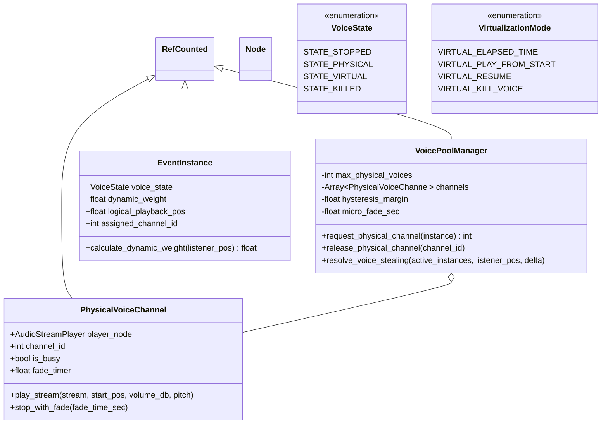

# Technical Specification: Virtual Voice System & Dynamic Voice Stealing (OpenDou Core)

**Module:** `addons/opendou/runtime/`, `addons/opendou/resources/`
**Status:** Approved / In Progress
**Reference Document:** [docs/architecture/voice-pooling.md](file:///c:/Users/Danielillo/projects/godot%20plugins/opendou/docs/architecture/voice-pooling.md)

---

## 1. Objective & Scope

The **Virtual Voice System** decouples high-level audio event playback from physical sound hardware channels. In scenes with hundreds of simultaneous audio emitters (explosions, gunshots, footsteps, ambient fauna), physical audio decoding is limited to a fixed pool of hardware channels (e.g. 32 to 64 voices).

Inaudible or low-priority sounds are transitioned into **Virtual Voices**, whose playback position advances logically with zero CPU/DSP decoding cost. When returning to audibility, voices are seamlessly devirtualized.

---

## 2. Architecture & Class Diagram

---

## 3. Dynamic Weight & Stealing Algorithm

### 3.1. Dynamic Priority Weight Calculation
$$\text{Weight} = \text{BasePriority} \times \text{LinearVolume} \times \text{DistanceFactor}$$
* $\text{LinearVolume} = 10^{\frac{\text{Volume}_{\text{dB}}}{20}}$
* $\text{DistanceFactor} = \max\left(0.0, 1.0 - \frac{\text{Distance}}{\text{MaxDistance}}\right)$
* If $\text{Distance} > \text{MaxDistance}$, $\text{Weight} = 0.0$ (immediate virtualization).

### 3.2. Anti-Glitching & AAA Invariants
1. **Micro-Fades (Anti-Clicking):** Virtualization or stealing executes a fast 10ms–20ms linear fade-out before disconnecting the physical player, preventing waveform discontinuity pops.
2. **Hysteresis (Anti-Thrashing):** Active physical voices receive a $+5\%$ priority bonus over virtual voices competing for the same slot, preventing frame-to-frame allocation oscillation.
3. **Category & Bus Limits:** Enables capping max simultaneous physical voices per sound category (e.g. max 4 footsteps, max 2 voice-overs).

---

## 4. Acceptance Criteria (DoD)

1. **Deterministic Voice Stealing:** Fixed pool limits (e.g. 4 channels for test, 64 for production) strictly respected under load.
2. **Virtual Tracking:** Virtualized voices advance logical time without executing engine decoders.
3. **Smooth Transitions:** Devirtualization resumes playback with correct seek offset and micro-fades.
4. **Headless Tests:** 100% test coverage validating stealing priority, distance culling, and virtualization modes.
